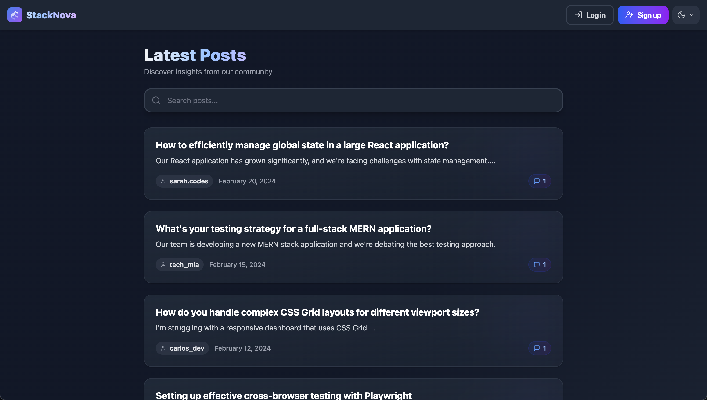
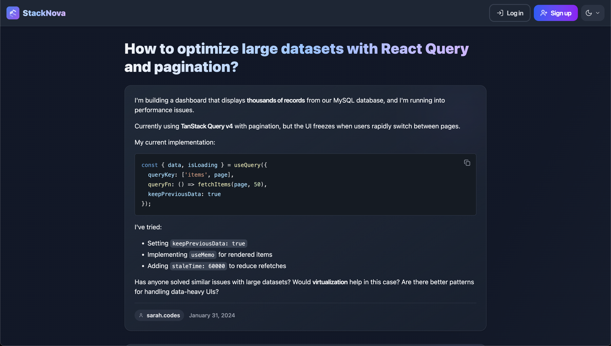
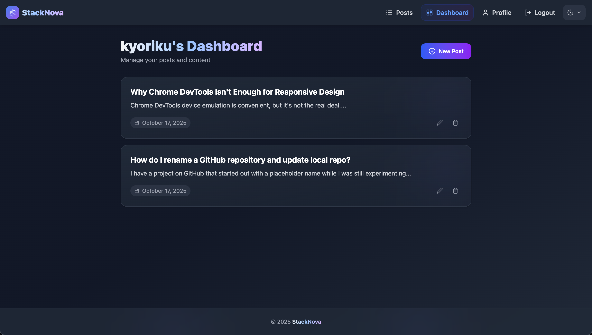
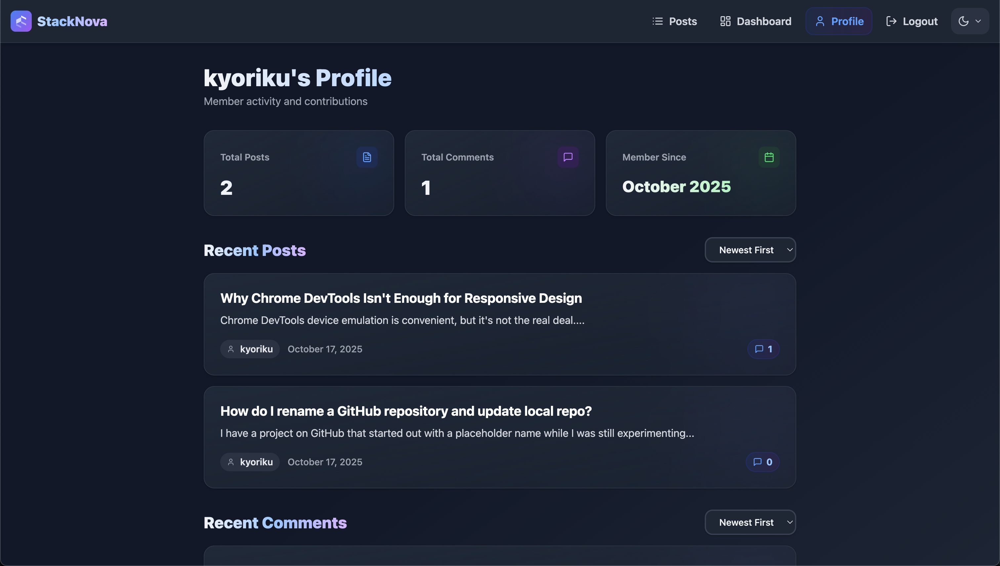

# StackNova

A software engineer community platform where developers ask questions, share knowledge, and engage in technical discussions.

**[Live Site](https://stacknova.ca)** | **Tech Stack:** React, Node.js, Express, MySQL, Redis, Tailwind CSS

**Key Features:** HTTP-only cookie authentication • Markdown with syntax highlighting • Redis caching • Search • Light/dark modes • Rate limiting & XSS prevention



<details>
<summary><b>Built With</b></summary>

[](https://developer.mozilla.org/en-US/docs/Web/JavaScript)
[](https://react.dev/)
[](https://tailwindcss.com/docs/installation/using-vite)
[](https://tanstack.com/query/latest/docs/framework/react/installation)
[](https://nodejs.org/)
[](https://expressjs.com/)
[](https://www.mysql.com/)
[](https://sequelize.org/)
[](https://redis.io/)
[](https://vite.dev/guide/)

</details>

## Table of Contents
- [Technical Details](#technical-details)
- [Screenshots](#screenshots)
- [Installation](#installation)
- [Usage](#usage)
- [Roadmap](#roadmap)
- [Contributing](#contributing)
- [License](#license)
- [Questions](#questions)

## Technical Details

**Frontend**
- React with hooks and Context API
- React Query for data fetching and caching
- Tailwind CSS with dark/light mode
- Code splitting and lazy loading
- Markdown rendering with syntax highlighting (react-markdown, prism-react-renderer)

**Backend**
- Node.js/Express REST API
- Express-session with HTTP-only cookies
- Session storage in Redis (connect-redis)
- Google OAuth integration (Passport.js)
- Bcrypt password hashing
- Rate limiting with Redis store (express-rate-limit, rate-limit-redis)
- Input validation (express-validator) and sanitization (sanitize-html)
- Helmet.js security headers

**Database**
- MySQL with Sequelize ORM
- Models: User, Post, Comment with associations
- UUID primary keys
- Indexed queries (email, slug, user_id, post_id)

**Performance & Caching**
- Redis for server-side caching and sessions
- React Query for client-side caching and prefetching
- Performance benchmarking with perf_hooks
- Load tested with k6 (50 concurrent users)

**Features**
- Search by title, content, author, date, or comments
- Pagination (10 posts per page)
- User profiles with activity tracking
- SEO-friendly URLs with automatic slug generation
- Sitemap generation for search engines
- Remember Me option (30-day sessions)
- XSS prevention via sanitization

## Screenshots
<details>
<summary><b>View More Screenshots</b></summary>





</details>

## Installation
To run this project locally:

1. Clone the repository
    ```bash
    git clone https://github.com/kyoriku/stack-nova.git
    ```

2. Navigate to the project directory
    ```bash
    cd stack-nova
    ```

3. Install dependencies
    ```bash
    npm install
    ```

4. Create a `.env` file in the server directory
    ```bash
    # Database Configuration
    DB_NAME='stacknova_db'
    DB_USER='your_MySQL_username'
    DB_PASSWORD='your_MySQL_password'
    
    # Session Configuration
    SESSION_SECRET='your_session_secret'
    
    # Redis Configuration
    REDIS_URL='redis://localhost:6379'
    
    # URLs
    CLIENT_URL='http://localhost:3000'
    SERVER_URL='http://localhost:3001'
    
    # Google OAuth Configuration
    GOOGLE_CLIENT_ID='your_google_client_id'
    GOOGLE_CLIENT_SECRET='your_google_client_secret'
    
    # Node Environment
    NODE_ENV='development'
    ```

5. Set up the database
    ```bash
    mysql -u root -p
    source db/schema.sql
    ```

6. Set up Redis (required for sessions and caching)
    ```bash
    # Install Redis if not already installed
    # For macOS:
    brew install redis
    
    # For Ubuntu:
    sudo apt-get install redis-server
    
    # Start Redis server
    redis-server
    ```

7. (Optional) Seed the database
    ```bash
    npm run seed
    ```

## Usage
1. Start the development server
    ```bash
    npm run dev
    ```

2. Access the application at `http://localhost:3000`

3. Create an account to ask questions, post answers, and view your activity

## Roadmap
- [x] Accessibility improvements
- [x] SEO meta tags
- [x] Favicon
- [x] Code modularization
- [x] Social login options
- [ ] Answer acceptance feature
- [ ] User reputation system
- [ ] Real-time notifications

## Contributing
Contributions are welcome:

1. Fork the repository
2. Create a feature branch (`git checkout -b feature/YourFeature`)
3. Make your changes
4. Commit and push to your branch
5. Open a Pull Request

## License
[](https://opensource.org/licenses/MIT)

This project is licensed under the [MIT](https://opensource.org/licenses/MIT) license.

## Questions
For questions, email me at devkyoriku@gmail.com.